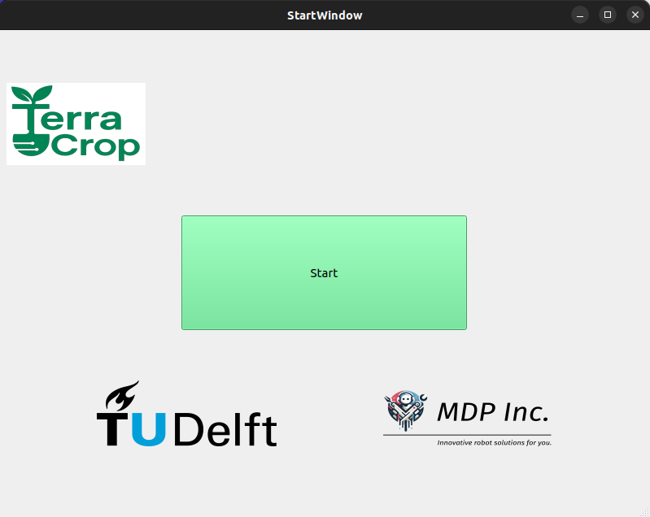
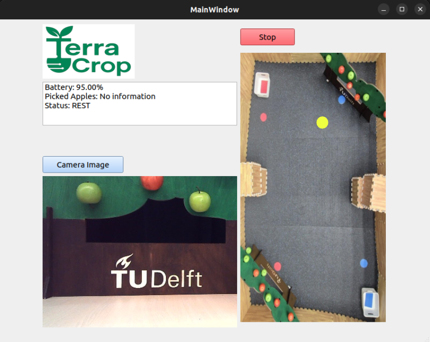

# task_gui

## Overview

`task_gui` is a ROS 2 package that provides a PyQt5-based graphical interface for the farmer. The GUI is designed to inspect robot and task information, start/stop the operation, capture images on demand, and visualize the robot's location within the map of the operating environment.

## Features

- GUI-based interface built with PyQt5
- Start and stop control of the robot using FSM service commands
- Live display of:
  - Battery percentage
  - FSM status string
  - Picked apples count
- On-demand image capture from the robot’s camera topic
- Real-time robot position visualization on the static orchard map

## Layouts

### Start Window



### Main Window

- Orchard map with tree rows and baskets
- Yellow dot indicates the robot's live position
- On-demand image shown below map



## Robot Map and Localization

- A static overhead map image of the orchard is shown in the GUI.
- The robot's position is calculated using TF transform data from `map` to `base_link`.
- The position is visualized as a yellow circle on the map.

## Camera Functionality

- The GUI includes a button to trigger a one-time image capture.
- When clicked, a temporary ROS 2 subscription is created to `/camera/color/image_raw/compressed`.
- The first incoming frame is decoded using OpenCV and displayed in the GUI.
- The subscription is destroyed immediately after the image is received or if it times out.

## ROS 2 Interface

### Subscribed Topics

| Topic                                  | Message Type                  | Description                          |
|----------------------------------------|--------------------------------|--------------------------------------|
| `/camera/color/image_raw/compressed`   | `sensor_msgs/CompressedImage` | Receives image for on-demand capture |
| `/io/power/power_watcher`              | `sensor_msgs/BatteryState`    | Battery level percentage             |
| `/picked_apples_count`                 | `std_msgs/Int32`              | Number of apples picked              |
| `/fsm_debug`                           | `std_msgs/String`             | FSM state info                       |

### Services Used

| Service Name     | Service Type         | Purpose                                  |
|------------------|----------------------|------------------------------------------|
| `/send_state`    | `fsm/srv/SendState`  | Sends control commands to the FSM node   |

## Launching the Interface
To run the GUI individually, use the following command:
```bash
ros2 run task_gui gui_node
```
